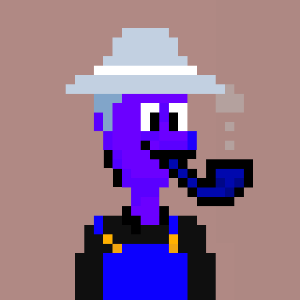

# Avatario

**Deterministic avatar generator for Ethereum addresses using layered NFT artwork**



## Overview

Avatario generates unique, deterministic avatars for Ethereum addresses by compositing multiple image layers. Each address always produces the same avatar, making it perfect for consistent user representation across Web3 applications.

Originally created for [baes.app](https://baes.app) to display Bario Punks-inspired avatars for users without ENS or Basename profile pictures.

## Features

- **Deterministic Generation** - Same address = same avatar, always
- **Layer-based Composition** - Combine multiple image layers for rich artwork
- **Multiple Sizes** - Support for 16px to 2048px output
- **Pixelated Rendering** - Crisp pixel art aesthetic
- **Smart Caching** - In-memory LRU cache for performance
- **Domain Protection** - Configurable domain whitelist
- **Vercel Ready** - Optimized for Vercel deployment

## API Usage

### Endpoint
```
GET /api/avatar/[address]?size=[size]
```

### Parameters
- `address` (required) - Valid Ethereum address (0x...)
- `size` (optional) - Avatar size in pixels (16-2048, default: 512)

### Examples
```bash
# Generate 512px avatar
curl https://avatario.baes.so/api/avatar/0x742d35Cc6634C0532925a3b844Bc9e7595f0fEb1

# Generate 256px avatar
curl https://avatario.baes.so/api/avatar/0x742d35Cc6634C0532925a3b844Bc9e7595f0fEb1?size=256
```

### Response
Returns a PNG image with the following headers:
- `Content-Type: image/png`
- `Cache-Control: public, max-age=31536000, immutable`
- `X-Cache: HIT|MISS` (cache status)

## Quick Start

### Prerequisites
- Node.js 18+
- npm or yarn

### Installation

1. **Clone the repository**
   ```bash
   git clone https://github.com/your-username/avatario.git
   cd avatario
   ```

2. **Install dependencies**
   ```bash
   npm install
   ```

3. **Add your artwork layers**
   
   Create your layer folders in `public/layers/`:
   ```
   public/layers/
   ├── 01-Background/
   │   ├── bg1.png
   │   ├── bg2.png
   │   └── ...
   ├── 02-Character/
   │   ├── char1.png
   │   ├── char2.png
   │   └── ...
   └── 03-Accessories/
       ├── acc1.png
       ├── acc2.png
       └── ...
   ```

4. **Update layer configuration**
   
   Edit `app/types/index.ts`:
   ```typescript
   export const LAYER_FOLDERS = [
     '01-Background',
     '02-Character', 
     '03-Accessories'
   ] as const;
   ```

5. **Configure allowed domains** (optional)
   
   Edit `app/lib/domain-validator.ts`:
   ```typescript
   const PRODUCTION_DOMAINS = [
     'yourdomain.com',
     'yourapp.io'
   ];
   ```

6. **Run development server**
   ```bash
   npm run dev
   ```

7. **Test your API**
   
   Visit `http://localhost:3000` and test with an Ethereum address!

## Customization

### Adding Your NFT Collection

1. **Prepare your layers**: Ensure all images are the same size (recommended: 1000x1000px)
2. **Organize in folders**: Name folders with prefixes (01-, 02-, etc.) to control layer order
3. **Update configuration**: Modify `LAYER_FOLDERS` in `app/types/index.ts`
4. **Customize selection logic**: Edit `app/lib/avatar-generator.ts` if needed

### Layer Requirements
- **Format**: PNG with transparency support
- **Size**: All images should be the same dimensions
- **Naming**: Use consistent naming (numbers, descriptive names, etc.)

### Configuration Options

**Avatar sizes** (`app/types/index.ts`):
```typescript
export const DEFAULT_AVATAR_SIZE = 512;
export const MIN_AVATAR_SIZE = 16;
export const MAX_AVATAR_SIZE = 2048;
```

**Cache settings** (`app/lib/avatar-cache.ts`):
```typescript
// Cache up to 200 avatars for 24 hours
const avatarCache = new AvatarCache(200, 24);
```

**Domain whitelist** (`app/lib/domain-validator.ts`):
```typescript
const PRODUCTION_DOMAINS = [
  'yourdomain.com'
];
```

## Deployment

### Vercel (Recommended)

1. **Connect your repository** to Vercel
2. **Configure environment**: No additional environment variables needed
3. **Deploy**: Vercel will automatically build and deploy

### Other Platforms

Ensure your platform supports:
- Node.js 18+
- Canvas library (for image processing)
- Static file serving from `public/`

## Algorithm

Avatario uses a deterministic algorithm to ensure consistency:

1. **Address Processing**: Ethereum address is normalized and converted to a numeric seed
2. **Layer Selection**: Each layer folder gets a pseudo-random selection based on the seed
3. **Image Composition**: Selected images are layered using Canvas API
4. **Pixelated Rendering**: Image smoothing is disabled for crisp pixel art output
5. **Caching**: Generated avatars are cached in memory and at CDN level

## Architecture

```
app/
├── api/avatar/[address]/     # API endpoint
├── lib/
│   ├── avatar-cache.ts       # LRU cache implementation
│   ├── avatar-generator.ts   # Layer selection logic
│   ├── domain-validator.ts   # Security & domain checking
│   ├── ethereum-utils.ts     # Address validation & processing
│   └── image-processor.ts    # Canvas-based image composition
├── types/index.ts            # TypeScript definitions
└── page.tsx                  # Demo interface
```

## Contributing

1. Fork the repository
2. Create a feature branch (`git checkout -b feature/amazing-feature`)
3. Commit your changes (`git commit -m 'Add amazing feature'`)
4. Push to the branch (`git push origin feature/amazing-feature`)
5. Open a Pull Request

## License

MIT License - see [LICENSE](LICENSE) file for details.

## Credits

Created by [Bario Entertainment System](https://baes.so)

- Website: [baes.so](https://baes.so)
- Sufficiently Decentralized Video Game Marketplace: [baes.app](https://baes.app)
- Twitter: [@basebario](https://x.com/basebario)

## Support

Need help or want to use this for your project? Reach out to us at [@basebario](https://x.com/basebario) on Twitter!
